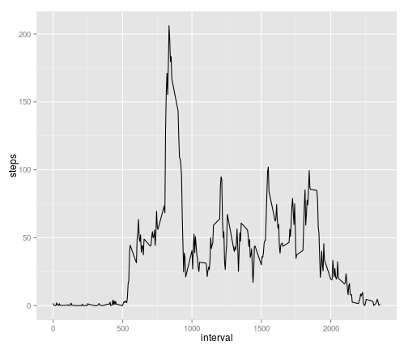
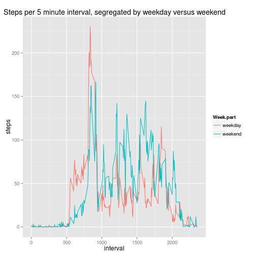

This is an analysis of the steps data set from https://github.com/rdpeng/RepData_PeerAssessment1, examining patterns with regard to the number of steps taken and plotting some of these.


## Loading and preprocessing the data

The data is provided in csv format, which can easily be loaded into R. It is then converted into a data.table for easier manipulation.

```r
library(data.table)
library(ggplot2)

steps.data <- read.csv("activity.csv")
steps.data <- data.table(steps.data)
```


## What is mean total number of steps taken per day?

Converting the data format into a new data table which has the number of steps in each day.

```r
steps.per.day <- steps.data[,list(steps=sum(steps)),by="date"]
steps.per.day[,date:=ymd(date)]
```

```
##           date steps
##  1: 2012-10-01    NA
##  2: 2012-10-02   126
##  3: 2012-10-03 11352
##  4: 2012-10-04 12116
##  5: 2012-10-05 13294
##  6: 2012-10-06 15420
##  7: 2012-10-07 11015
##  8: 2012-10-08    NA
##  9: 2012-10-09 12811
## 10: 2012-10-10  9900
## 11: 2012-10-11 10304
## 12: 2012-10-12 17382
## 13: 2012-10-13 12426
## 14: 2012-10-14 15098
## 15: 2012-10-15 10139
## 16: 2012-10-16 15084
## 17: 2012-10-17 13452
## 18: 2012-10-18 10056
## 19: 2012-10-19 11829
## 20: 2012-10-20 10395
## 21: 2012-10-21  8821
## 22: 2012-10-22 13460
## 23: 2012-10-23  8918
## 24: 2012-10-24  8355
## 25: 2012-10-25  2492
## 26: 2012-10-26  6778
## 27: 2012-10-27 10119
## 28: 2012-10-28 11458
## 29: 2012-10-29  5018
## 30: 2012-10-30  9819
## 31: 2012-10-31 15414
## 32: 2012-11-01    NA
## 33: 2012-11-02 10600
## 34: 2012-11-03 10571
## 35: 2012-11-04    NA
## 36: 2012-11-05 10439
## 37: 2012-11-06  8334
## 38: 2012-11-07 12883
## 39: 2012-11-08  3219
## 40: 2012-11-09    NA
## 41: 2012-11-10    NA
## 42: 2012-11-11 12608
## 43: 2012-11-12 10765
## 44: 2012-11-13  7336
## 45: 2012-11-14    NA
## 46: 2012-11-15    41
## 47: 2012-11-16  5441
## 48: 2012-11-17 14339
## 49: 2012-11-18 15110
## 50: 2012-11-19  8841
## 51: 2012-11-20  4472
## 52: 2012-11-21 12787
## 53: 2012-11-22 20427
## 54: 2012-11-23 21194
## 55: 2012-11-24 14478
## 56: 2012-11-25 11834
## 57: 2012-11-26 11162
## 58: 2012-11-27 13646
## 59: 2012-11-28 10183
## 60: 2012-11-29  7047
## 61: 2012-11-30    NA
##           date steps
```

```r
print(summary(steps.per.day$steps))
```

```
##    Min. 1st Qu.  Median    Mean 3rd Qu.    Max.    NA's 
##      41    8841   10760   10770   13290   21190       8
```

```r
hist <- ggplot(steps.per.day) + geom_histogram(aes(x=steps)) + ggtitle("Histogram of steps taken per day")
```
The mean number of steps per day is 1.0766189 &times; 10<sup>4</sup>, rounded to 1.0766 &times; 10<sup>4</sup>, not counting days with NAs for the whole set.  
The median number of steps per day is 10765, rounded to 1.0765 &times; 10<sup>4</sup>, not counting days with NAs for the whole set.  


## What is the average daily activity pattern?


Converting the data format again, this time to produce the mean of each time slot across all days. The mean is taken ignoring the NA values.


```r
steps.per.5min <- steps.data[,list(steps=mean(steps,na.rm=TRUE)),by="interval"]
ggplot(steps.per.5min) + geom_line(aes(x=interval,y=steps))
```

 

```r
subset(steps.per.5min, steps==max(steps.per.5min$steps))
```

```
##    interval    steps
## 1:      835 206.1698
```
The 5 minute interval with the most steps on average per day is 8:35, which has an average of a little over 206 steps.  


## Imputing missing values

In this case, for each 5 minute interval, all NA values are replaced by the mean of the non-NA values for that interval. This is intended to preserve intraday patterns, though it is at the expense of daily patterns. The values are rounded to the nearest integer.  


```r
steps.data.clean <- copy(steps.data)
for(this.interval in unique(steps.data.clean$interval)){
  interval.mean <- mean(subset(steps.data.clean, interval == this.interval)$steps,na.rm=TRUE)
  steps.data.clean[interval==this.interval & is.na(steps),steps:=round(interval.mean)]
}
```
The resultant histogram is as shown:


```r
steps.per.day <- steps.data.clean[,list(steps=sum(steps)),by="date"]
steps.per.day[,date:=ymd(date)]
```

```
##           date steps
##  1: 2012-10-01 10762
##  2: 2012-10-02   126
##  3: 2012-10-03 11352
##  4: 2012-10-04 12116
##  5: 2012-10-05 13294
##  6: 2012-10-06 15420
##  7: 2012-10-07 11015
##  8: 2012-10-08 10762
##  9: 2012-10-09 12811
## 10: 2012-10-10  9900
## 11: 2012-10-11 10304
## 12: 2012-10-12 17382
## 13: 2012-10-13 12426
## 14: 2012-10-14 15098
## 15: 2012-10-15 10139
## 16: 2012-10-16 15084
## 17: 2012-10-17 13452
## 18: 2012-10-18 10056
## 19: 2012-10-19 11829
## 20: 2012-10-20 10395
## 21: 2012-10-21  8821
## 22: 2012-10-22 13460
## 23: 2012-10-23  8918
## 24: 2012-10-24  8355
## 25: 2012-10-25  2492
## 26: 2012-10-26  6778
## 27: 2012-10-27 10119
## 28: 2012-10-28 11458
## 29: 2012-10-29  5018
## 30: 2012-10-30  9819
## 31: 2012-10-31 15414
## 32: 2012-11-01 10762
## 33: 2012-11-02 10600
## 34: 2012-11-03 10571
## 35: 2012-11-04 10762
## 36: 2012-11-05 10439
## 37: 2012-11-06  8334
## 38: 2012-11-07 12883
## 39: 2012-11-08  3219
## 40: 2012-11-09 10762
## 41: 2012-11-10 10762
## 42: 2012-11-11 12608
## 43: 2012-11-12 10765
## 44: 2012-11-13  7336
## 45: 2012-11-14 10762
## 46: 2012-11-15    41
## 47: 2012-11-16  5441
## 48: 2012-11-17 14339
## 49: 2012-11-18 15110
## 50: 2012-11-19  8841
## 51: 2012-11-20  4472
## 52: 2012-11-21 12787
## 53: 2012-11-22 20427
## 54: 2012-11-23 21194
## 55: 2012-11-24 14478
## 56: 2012-11-25 11834
## 57: 2012-11-26 11162
## 58: 2012-11-27 13646
## 59: 2012-11-28 10183
## 60: 2012-11-29  7047
## 61: 2012-11-30 10762
##           date steps
```

```r
print(summary(steps.per.day$steps))
```

```
##    Min. 1st Qu.  Median    Mean 3rd Qu.    Max. 
##      41    9819   10760   10770   12810   21190
```

```r
clean.hist <- ggplot(steps.per.day) + geom_histogram(aes(x=steps)) + ggtitle("Histogram of steps taken per day")
mean.per.day <- mean(steps.per.day$steps)
median.per.day <- median(steps.per.day$steps)
```

This has a slight movement up in scale compared to the previous run. It also makes the number of steps per day somewhat more homogenous.  
The mean number of steps per day is 1.0765639 &times; 10<sup>4</sup> and the median number of steps per day is 10762 - both have dropped by a few steps per day only.  
Thus the effect is not really to change the mean and median, but rather to tighten up the variance in the dates.  


## Are there differences in activity patterns between weekdays and weekends?


Creating a new column, "Week.part"
If a given interval is on Saturday or Sunday, make it have "weekend", else make it have "weekday." (Do this by creating it with value weekday and then converting to weekend)  
Then convert to factor.


```r
steps.data.clean[,Week.part:="weekday"]
```

```
##        steps       date interval Week.part
##     1:     2 2012-10-01        0   weekday
##     2:     0 2012-10-01        5   weekday
##     3:     0 2012-10-01       10   weekday
##     4:     0 2012-10-01       15   weekday
##     5:     0 2012-10-01       20   weekday
##    ---                                    
## 17564:     5 2012-11-30     2335   weekday
## 17565:     3 2012-11-30     2340   weekday
## 17566:     1 2012-11-30     2345   weekday
## 17567:     0 2012-11-30     2350   weekday
## 17568:     1 2012-11-30     2355   weekday
```

```r
steps.data.clean[weekdays(ymd(date)) %in% c("Saturday","Sunday"),Week.part:="weekend"]
```

```
##        steps       date interval Week.part
##     1:     2 2012-10-01        0   weekday
##     2:     0 2012-10-01        5   weekday
##     3:     0 2012-10-01       10   weekday
##     4:     0 2012-10-01       15   weekday
##     5:     0 2012-10-01       20   weekday
##    ---                                    
## 17564:     5 2012-11-30     2335   weekday
## 17565:     3 2012-11-30     2340   weekday
## 17566:     1 2012-11-30     2345   weekday
## 17567:     0 2012-11-30     2350   weekday
## 17568:     1 2012-11-30     2355   weekday
```

```r
steps.data.clean$Week.part <- as.factor(steps.data.clean$Week.part)
steps.data.5min.segregated <- steps.data.clean[,list(steps=mean(steps,na.rm=TRUE)),by=c("interval","Week.part")]

ggplot(steps.data.5min.segregated) + geom_line(aes(x=interval,y=steps,colour=Week.part)) + ggtitle("Steps per 5 minute interval, segregated by weekday versus weekend")
```

 
  
The overall result here is that activity starts later on the weekend, and peaks lower but is more consistent. Note that both sets have missing values filled in as the average of the whole-week value for that interval, so without the filled in missing data it may be even clearer.


